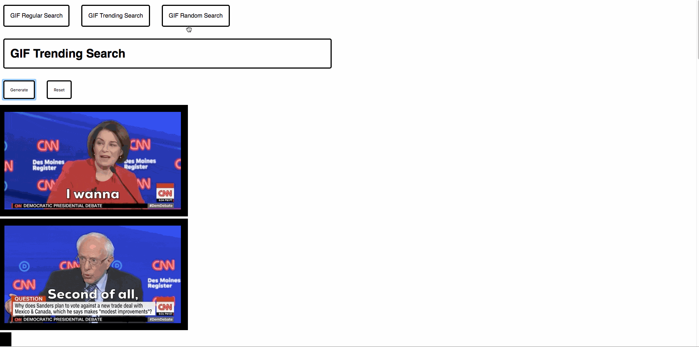

### *Name: Chanyu C.*

### Group Project: Tech Talent Pipeline: Cohort 5 - Bootcamp
### Program Name: Assignment 7 (GIPHY Assignment)

### Description:
```
- There's router setup, default link is on Regular Search.
- For Regular Search, user can type in a keyword and click search. 
- Button will trigger the fetch. Which pulls the API.
- API key is already generated and assigned to it.
- Successful execution will return array of data in setState.
- Then its updated data will forward the state as props to Search.js
- Search.js wraps it in img and returns back img to display.

- Trend and Random only has generate button. It'll auto fetch latest gifs.
- The program uses React + its component to use it.
```

### Pictures:
