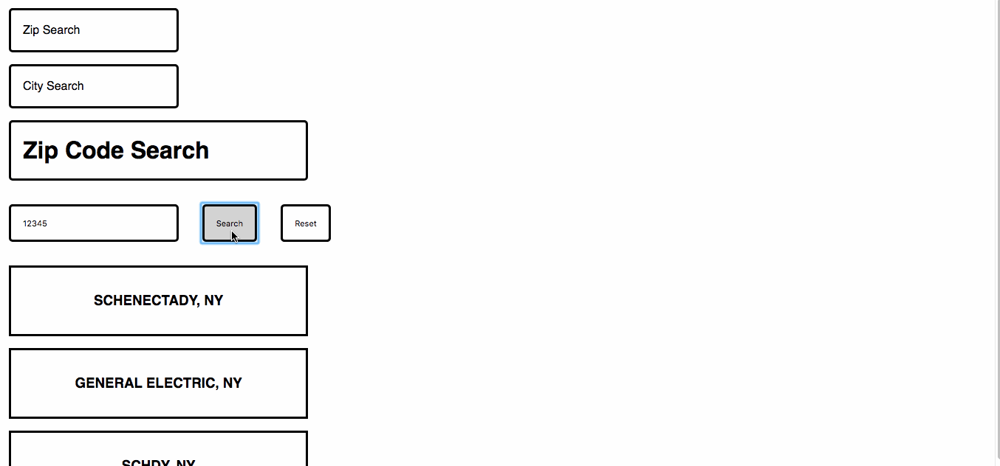

### *Name: Chanyu C.*

### Group Project: Tech Talent Pipeline: Cohort 5 - Bootcamp
### Program Name: Assignment 6 (Zip and City Name Search)

### Description:
```
- There's router setup, default link is on Zip Search.
- There user can type in the zip code/city name and click search. 
- Button will trigger the fetch. Which pulls the API.
- Returns the data in form of appendChild and outputs it in HTML.
- The program uses React + its component to use it.
```

### Pictures:
