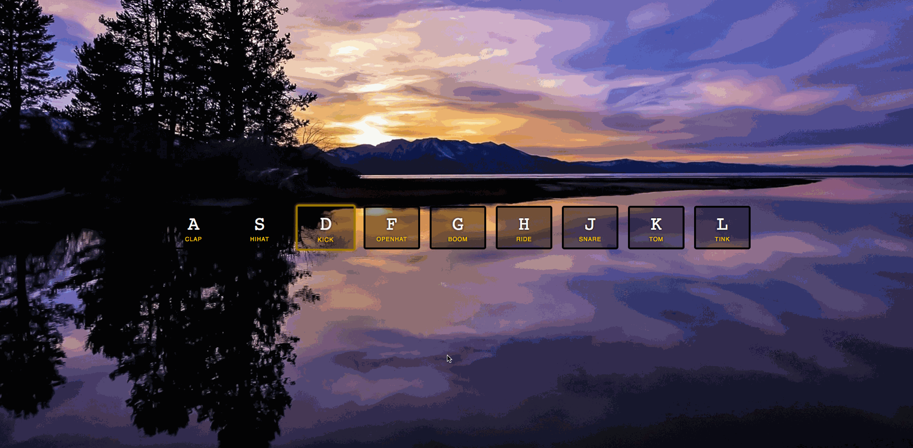

### *Name: Chanyu C.*

### Group Project: Tech Talent Pipeline: Cohort 5 - Pre-Bootcamp
### Program 1 Name: Drum Kit Website

### Description: 
``` 
It's an interactive CSS website that takes in a keyboard input 
and corresponding key will play a sound in the Drumkit. 
This website consists of HTML, CSS and Javascript. 
It also has a sound resources that it's referencing to. 

For complete commit history:
https://github.com/cchanyu/30-days-javascript
```

### Preview:
<a href = "gif1-1.gif">