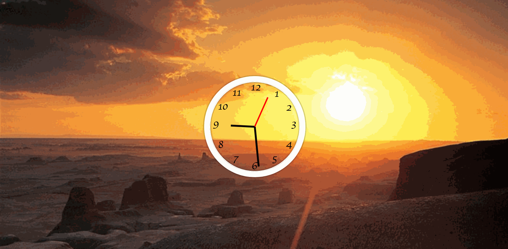

### *Name: Chanyu C.*

### Group Project: Tech Talent Pipeline: Cohort 5 - Pre-Bootcamp
### Program 2 Name: CSS & JS Clock Website

### Description: 
``` 
This site has a fully functioning clock. 
It has 3 hands. Hour, Minute and Second.
It grabs the time from your computer and display it visually.
My plan is to add numbers and make new hands on this. 
```
### Post-Course Update 1:
```
Resized and recolored hands.
Hour hand - black - shortest length
Mins hand - black - longest length
Secs hand - red - medium length
```
### Post-Course Update 2:
```
Added numerical display using CSS
```

### Preview:
<a href = "gif2-1.gif">