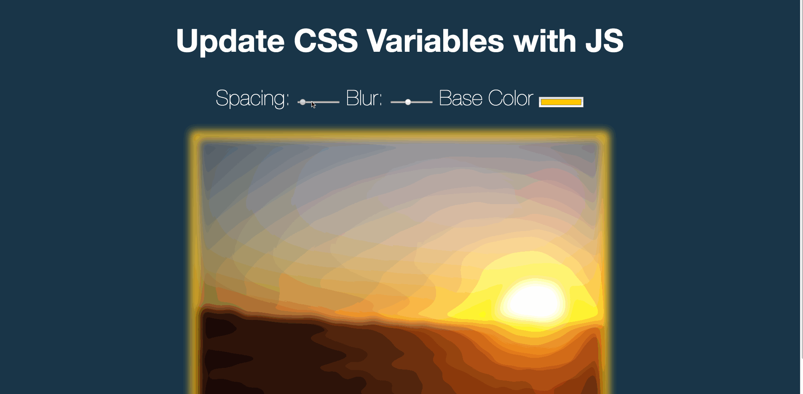

### *Name: Chanyu C.*

### Group Project: Tech Talent Pipeline: Cohort 5 - Pre-Bootcamp
### Program 3 Name: CSS Variables Website

### Description: 
``` 
This site allows you to do 3 different thing on your image.
You can either do spacing, blur or base color change.
This is based on HTML, CSS variables and Javascript.

Potential: Maybe it can accept user input image and display on it.
```

### Preview: 
<a href = "gif3-1.gif">