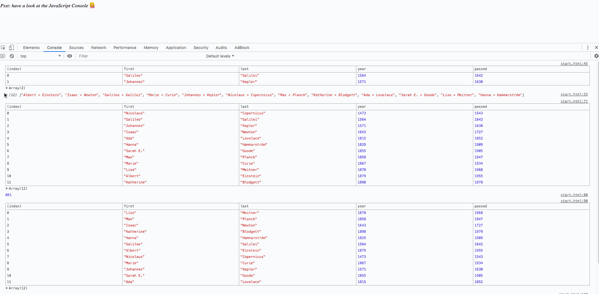

### *Name: Chanyu C.*

### Group Project: Tech Talent Pipeline: Cohort 5 - Pre-Bootcamp
### Program 4 Name: Array Cardio Day 1

### Description: 
``` 
Array Cardio Day 1 is 8 basic exercise to teach myself how to use array flexibly in Javascript. 
There's a given Array we start with. One of them selected people who were born in 1500s.
The other sorted by their birthdate, or first/last names. Also there's a wikipedia exercise that
allowed us to grab Node list that only contains 'de'. The last exercise was about summing each
instances of transportation list.
```

### Preview:
<a href = "gif4.gif">