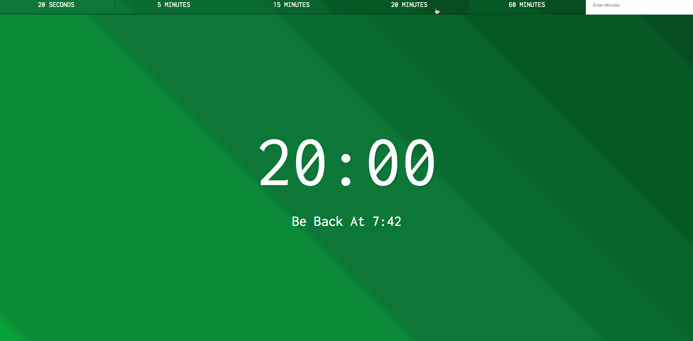

### *Name: Chanyu C.*

### Group Project: Tech Talent Pipeline: Cohort 5 - Pre-Bootcamp
### Program 29 Name: Countdown Timer

### Description: 
``` 
Countdown Timer is a convenient timer that you can simply press
a button and have a quick break. It also displays what time you
should return. You can also have a custom input minutes for the
timer.

Potentials:
- Adding a sound to alert when the clock is over
- Allow Hour+ options
```

### Preview:
<a href = "gif29.gif">