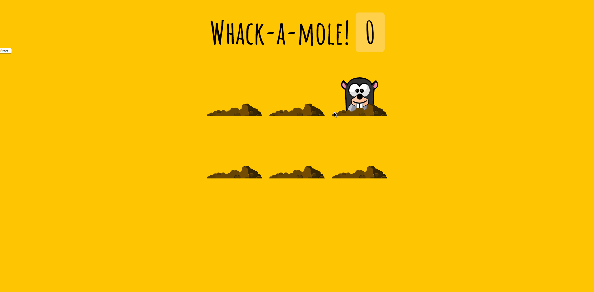

### *Name: Chanyu C.*

### Group Project: Tech Talent Pipeline: Cohort 5 - Pre-Bootcamp
### Program 30 Name: Whack A Mole

### Description: 
``` 
Whack A Mole is a web browser game that allows users to click
on moles that appear from the hole. There's total of 6 holes,
and they only pop up for a periodic time. But once you smash
it, the scoreboard goes up.

Potential + Bug:
- Clicking fast multiple times adds up more than 1 value..
- Start Button can be improved.
- End screen should pop up after game ends.
- Allow more difficulties, challenge levels, hole amount
```

### Preview:
<a href = "gif30.gif">